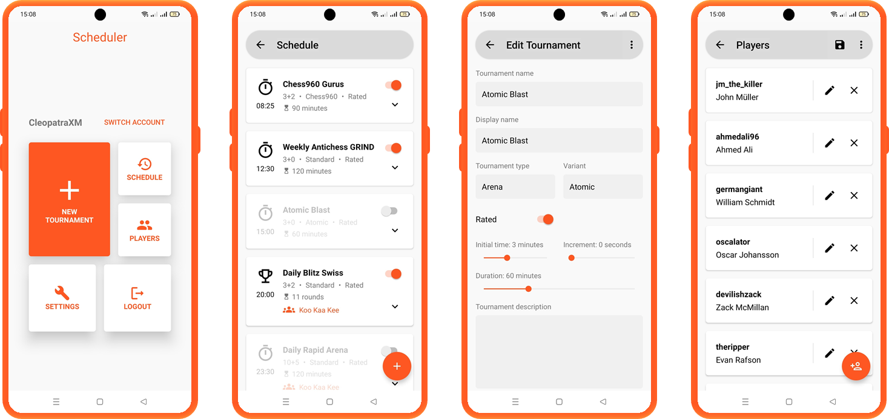

Lichess Scheduler is an android app for scheduling tournaments on [lichess.org](https://lichess.org). It offers automatic tournament scheduling with great ease. It is also highly customizable to adapt to your scheduling needs.

## System requirements
* Android 5.0 or above

## Get the app
**Note: the app is currently under development.** You can download the debug build of the app [here](https://github.com/WaisKamal/lichess-scheduler/raw/main/android/app/build/outputs/apk/debug/app-debug.apk).
